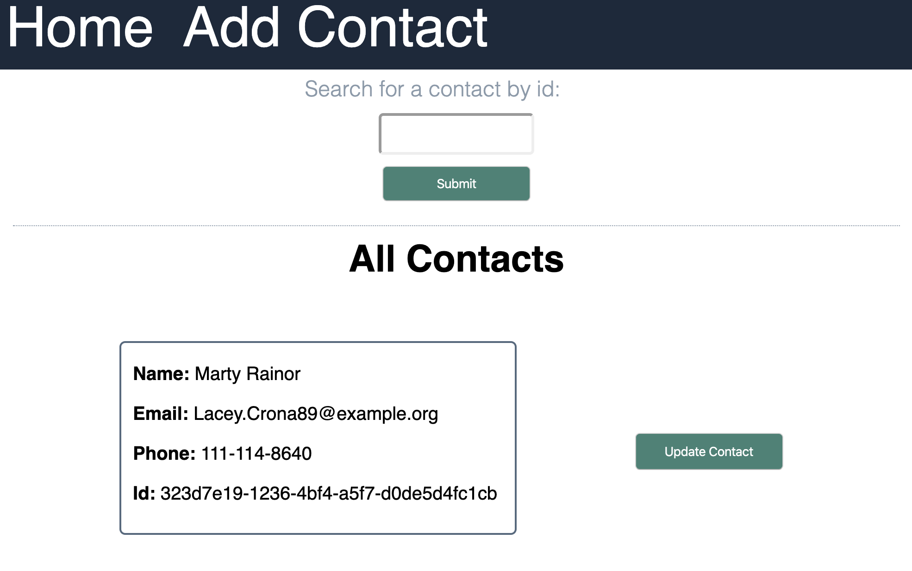

### Arcadia Power Contacts

This is a small CRUD application that uses a Node-Express server in the server directory of Arcadia-FE-HW-2019 to manage a contact list.

### Instructions

1. Install dependencies and run the server using `npm install` and `node server` in the Arcadia-FE-HW-2019 directory.

2. Clone down this repository. Install dependencies and run the application in this directory using `npm install` and `npm run start`.

### Using the application

The home page takes you to a search field as well as a list of all contacts.

In the search field you can search for a contact by id.

To update a contact, click `Update Contact`. This takes you to a form where you can update any contact information for this contact or delete the contact.

In the nav bar, you can click `Add Contact` to go to the add contact field. Here you must enter information in all three fields to successfully submit a new contact to the API.

If you use the nav bar to return to the home page, you will see your new contact at the bottom of the page.
